<p align="center">
  <h1 align="center">🏭 CRM Kilang Desa Murni Batik</h1>
  <p align="center">
    <strong>Enterprise-Grade Multi-Tenant CRM Platform for Batik Industry</strong>
  </p>
  <p align="center">
    
    
    
    
  </p>
</p>

---

## 🎯 Overview

CRM Kilang Desa Murni Batik is a **production-ready, multi-tenant Customer Relationship Management** platform built specifically for the batik manufacturing industry. Designed with enterprise-grade microservices architecture, it enables businesses to manage leads, customers, sales pipelines, and notifications at scale.

### ✨ Why This CRM?

- 🏢 **Multi-Tenant Architecture** — Securely isolate data for multiple business units
- ⚡ **High Performance** — Built with Go for blazing-fast response times
- 🔒 **Enterprise Security** — OAuth2, RBAC, ABAC, and comprehensive audit logging
- 📈 **Scalable** — Kubernetes-ready with auto-scaling capabilities
- 🔄 **Event-Driven** — Saga patterns for reliable distributed transactions

---

## 🏗 Architecture

```mermaid
flowchart TB
    subgraph Clients["🖥️ Clients"]
        WEB[Web App]
        MOBILE[Mobile App]
        API_CLIENT[API Clients]
    end

    subgraph Gateway["🚪 API Gateway"]
        GW[API Gateway Service]
        AUTH_MW[Auth Middleware]
        RATE[Rate Limiter]
    end

    subgraph Services["⚙️ Microservices"]
        IAM[IAM Service<br/>Authentication & Authorization]
        CUSTOMER[Customer Service<br/>CRM & Contacts]
        SALES[Sales Service<br/>Leads, Opportunities, Deals]
        NOTIFICATION[Notification Service<br/>Email, SMS, Push]
    end

    subgraph Data["💾 Data Layer"]
        PG[(PostgreSQL<br/>IAM, Sales)]
        MONGO[(MongoDB<br/>Customers)]
        REDIS[(Redis<br/>Cache, Sessions)]
        RABBIT[(RabbitMQ<br/>Events)]
    end

    subgraph Observability["📊 Observability"]
        PROM[Prometheus]
        GRAFANA[Grafana]
        JAEGER[Jaeger Tracing]
        LOKI[Loki Logging]
    end

    Clients --> Gateway
    GW --> AUTH_MW --> RATE
    Gateway --> Services
    IAM --> PG
    IAM --> REDIS
    CUSTOMER --> MONGO
    CUSTOMER --> REDIS
    SALES --> PG
    SALES --> REDIS
    NOTIFICATION --> PG
    Services --> RABBIT
    Services --> Observability
```



---

## 🛠 Tech Stack

| Category | Technologies |
|----------|-------------|
| **Backend** | Go 1.21+, Chi Router, Wire DI |
| **Databases** | PostgreSQL 15, MongoDB 6.0 |
| **Caching** | Redis 7.0 |
| **Messaging** | RabbitMQ 3.12 |
| **Auth** | JWT, OAuth2/OIDC, Argon2 |
| **Containers** | Docker, Docker Compose |
| **Orchestration** | Kubernetes, Helm 3 |
| **Observability** | Prometheus, Grafana, Jaeger, Loki |
| **CI/CD** | GitHub Actions |

---

## 🚀 Getting Started

### Prerequisites

- Go 1.21+
- Docker & Docker Compose
- Make (optional)

### Quick Start

```bash
# 1. Clone the repository
git clone https://github.com/MuhammadLuqman-99/CRMKilangDesaMurniBatik.git
cd CRMKilangDesaMurniBatik

# 2. Copy environment file
cp .env.example .env

# 3. Configure your environment variables
# Edit .env file with your settings

# 4. Start all services
docker-compose up -d

# 5. Run database migrations
make migrate-up

# 6. Verify services are running
docker-compose ps
```

### Service Endpoints

| Service | Port | Health Check |
|---------|------|--------------|
| API Gateway | 8080 | `/health` |
| IAM Service | 8081 | `/health` |
| Customer Service | 8082 | `/health` |
| Sales Service | 8083 | `/health` |
| Notification Service | 8084 | `/health` |

---

## 📋 Key Features

### 🔐 IAM Service (Identity & Access Management)
- Multi-tenant user management with role-based access
- OAuth2/OIDC integration (Google, Microsoft, GitHub)
- RBAC & ABAC policy engine
- Session management with token rotation
- Comprehensive audit logging

### 👥 Customer Service
- Full customer lifecycle management
- Contact management with communication preferences
- Customer segmentation (static & dynamic)
- Import/Export (CSV, XLSX, JSON)
- Activity tracking and notes

### 💼 Sales Service
- Lead management with scoring & qualification
- Opportunity pipeline with customizable stages
- Deal tracking with line items & invoicing
- Saga-based lead conversion workflow
- Sales analytics and forecasting

### 📬 Notification Service
- Multi-channel delivery (Email, SMS, Push, In-App)
- Template management with localization
- Circuit breaker & retry mechanisms
- Provider fallback (SendGrid, Twilio, etc.)

---

## 📖 Documentation

| Document | Description |
|----------|-------------|
| [API Overview](docs/API_OVERVIEW.md) | API endpoints and authentication |
| [Deployment Guide](docs/DEPLOYMENT.md) | Production deployment instructions |
| [Project Plan](docs/PROJECT_PLAN.md) | Detailed project architecture |
| [Task Checklist](docs/TASK_CHECKLIST.md) | Implementation progress |

---

## 🧪 Testing

```bash
# Run unit tests
make test

# Run integration tests
make test-integration

# Run all tests with coverage
make test-coverage
```

---

## 📦 Deployment

For production deployment, refer to the [Deployment Guide](docs/DEPLOYMENT.md).

```bash
# Deploy with Helm
helm install crm-platform ./deployments/helm/crm-platform \
  --namespace crm \
  --create-namespace \
  -f ./deployments/helm/crm-platform/values-prod.yaml
```

---

## 🤝 Contributing

Contributions are welcome! Please read our contributing guidelines before submitting PRs.

---

## 📄 License

This project is licensed under the MIT License - see the [LICENSE](LICENSE) file for details.

---

<p align="center">
  <strong>Built with ❤️ for Kilang Desa Murni Batik</strong>
</p>
